```
██████╗      ██╗██╗██████╗ ██╗   ██╗    ███████╗ ██████╗ ██╗    ██╗
██╔══██╗     ██║██║██╔══██╗╚██╗ ██╔╝    ██╔════╝██╔═══██╗██║    ██║
██║  ██║     ██║██║██████╔╝ ╚████╔╝     ███████╗██║   ██║██║ █╗ ██║
██║  ██║██   ██║██║██╔══██╗  ╚██╔╝      ╚════██║██║   ██║██║███╗██║
██████╔╝╚█████╔╝██║██████╔╝   ██║       ███████║╚██████╔╝╚███╔███╔╝
╚═════╝  ╚════╝ ╚═╝╚═════╝    ╚═╝       ╚══════╝ ╚═════╝  ╚══╝╚══╝
```

<div align="center">

[](https://www.linkedin.com/in/djiby-sow-rebollo/)
[](https://github.com/Lancelcode)
https://komarev.com/ghpvc/?username=Lancelcode

</div>

---

## `$ whoami`

```json
{
  "name"       : "Djiby Sow Rebollo",
  "role"       : "Software Engineering Student → Systems & Security Engineer",
  "university" : "Edinburgh Napier University (BSc Software Development, Sep 2026)",
  "location"   : "Edinburgh , Scotland",
  "focus"      : ["Systems", "Backend ", "Security ", "AI/ML engineering applied to <----S.B.S"],
  "building"   : ["PulseDB, database engine from scratch", "Own shell", "AI coding agent"],
  "learning"   : ["Python at depth", "AI/ML engineering", "Applied cryptography"],
  "principle"  : "Understand the machine. Don't just use the tools, build them."
}
```

---

## `$ ls -la projects/flagship/`

### 🧠 PulseDB — Database Engine from Scratch
> *The project that started with a question: how does a database actually work?*

Building a functional database engine without external libraries — storage management, B-tree indexing, a query parser, and execution engine from first principles. Not a tutorial. Not a clone. A deliberate attempt to understand what happens below the ORM.

**What I've learned that no course teaches:**
- Why page sizes matter for I/O performance
- How indexes trade write speed for read speed at the byte level
- What "ACID" actually costs in implementation terms

`C` `Java` `Systems Design` `Storage Engines` `Data Structures`

---

### 🔧 project-manager-api — Production-Ready REST API
> *Not "hello world" with a database. An actual backend.*

JWT authentication, role-based access control, PostgreSQL, Docker, full CI/CD pipeline via GitHub Actions, and complete test coverage. Built from scratch in Java 21 + Spring Boot, designed to be deployed, not just demoed.

`Java` `Spring Boot` `PostgreSQL` `Docker` `Maven` `JWT` `GitHub Actions`

---

### 🌱 GreenScore — Full-Stack Sustainability Platform
> *42 PHPUnit tests. CSRF protection. Rate limiting. Certificate generation. The works.*

A full-stack web platform built in PHP with session management, role-based admin dashboard, REST API, and a proper security layer. The kind of project that teaches you what "production-ready" actually means.

`PHP` `MySQL` `Bootstrap` `PHPUnit` `Security` `REST API`

---

### 🔍 nvvri — AI-Powered Nursery Finder
> *Natural language search. No CSS frameworks. Deployed.*

Nursery finder with AI-driven natural language search, filtering by area, age range, Ofsted rating, and price. Built with Next.js 15, React 19, and TypeScript — without reaching for Bootstrap or Tailwind. Live at [nvvri.vercel.app](https://nvvri.vercel.app).

`TypeScript` `Next.js` `React` `AI` `Vercel`

---

### ⚙️ Rebuilding the Stack — Tools from Protocol Level
> *If you can build it, you understand it.*

A running series of systems-level reimplementations:

| Tool | Status | What it taught me |
|------|--------|-------------------|
| Group Chat (Sockets) | 🔄 In progress | TCP, multi-client handling, concurrency |
| Own Shell | 🔄 In progress | Process forking, pipes, signals, PATH resolution |
| AI Coding Agent | 🔄 In progress | LLM APIs, tool calling, agent loops |
| Redis clone | ✅ Complete | In-memory data structures, serialisation, persistence |
| Git internals | 📋 Planned | Content-addressable storage, DAGs, hashing |
| Compiler (subset) | 📋 Planned | Lexing, parsing, AST, code generation |

`C` `Java` `Python` `Networking` `Protocols` `Systems`

---

### 🔐 Security Labs
> *Offensive skills make better defensive engineers.*

Hands-on security research across penetration testing, log analysis, CVE research, and hardening. Documenting findings and write-ups as I progress through TryHackMe and Hack The Box tracks.

`Parrot OS` `Linux` `Pen Testing` `CVE Analysis` `Hardening`

---

## `$ cat current_learning.log`

```
[2026] ████████████░░░░░░░░  Python mastery          — OOP, testing, packaging
[2026] ██████░░░░░░░░░░░░░░  AI/ML foundations       — numpy, pandas, sklearn
[2026] ████████░░░░░░░░░░░░  Applied security        — TryHackMe, PortSwigger
[2026] █████████████████░░░  Systems programming     — memory, concurrency, I/O
```

The roadmap: strong systems foundations → production Python → ML engineering → DevSecOps.
Everything connects. Security makes me a better engineer. Systems knowledge makes me a better security researcher. ML gives me a new set of tools to apply to both.

---

## `$ cat stack.txt`

**Languages**


**Backend & Frameworks**


**Web & Frontend**


**Databases**


**Testing**


**Build Tools**


**Infrastructure & DevOps**


**Security**


---

## `$ cat philosophy.txt`

I came into software engineering from an unusual direction — not from a computer science family or a bootcamp, but from figuring things out because I had to. That gives me something I think is genuinely useful: I am not afraid of not knowing something, because not knowing has always just been the starting point.

I build things from scratch not to reinvent wheels, but because you cannot truly understand a wheel until you have tried to build one. Every system I rebuild teaches me something no tutorial ever could.

Long term: DevSecOps and AI-driven security tooling. Right now: laying the kind of foundations that make those goals realistic.

> If not me, who? If not now, when?


---
<div align="center">




</div>

---


## `$ echo "Let's talk"`

Working on something in backend systems, security tooling, or infrastructure engineering? Want to exchange ideas on systems design, applied security, or ML in security contexts?

[](https://www.linkedin.com/in/djiby-sow-rebollo/)

---

<div align="center">
<sub>⚡ Actively building · 📍 Edinburgh, Scotland · 🎯 Open to junior engineering roles from late 2026</sub>
</div>
